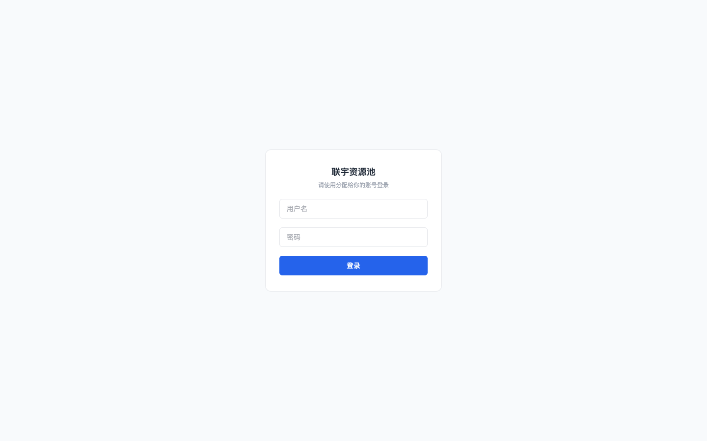
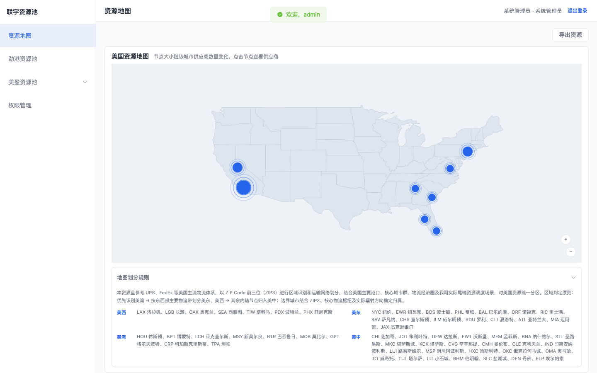
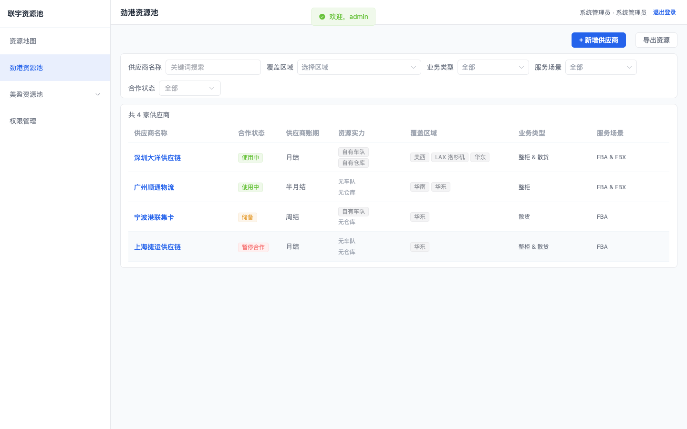
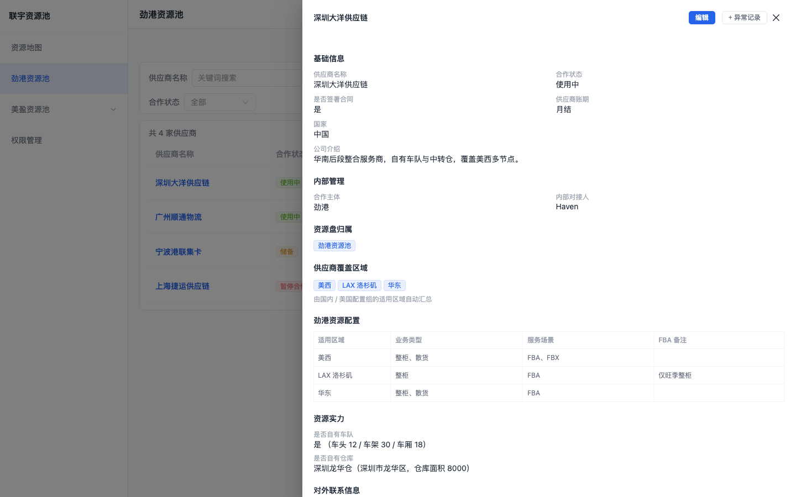
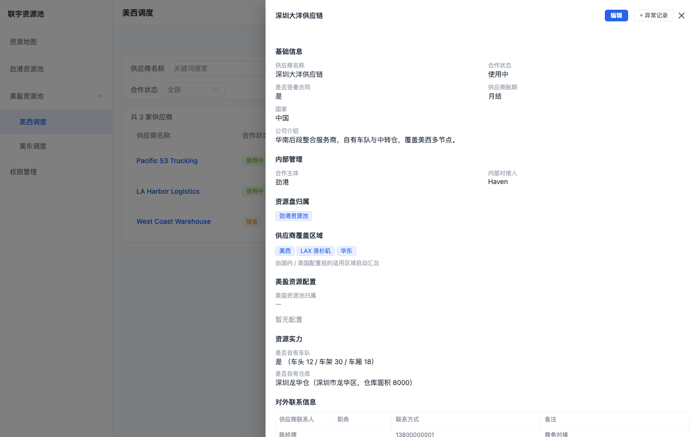
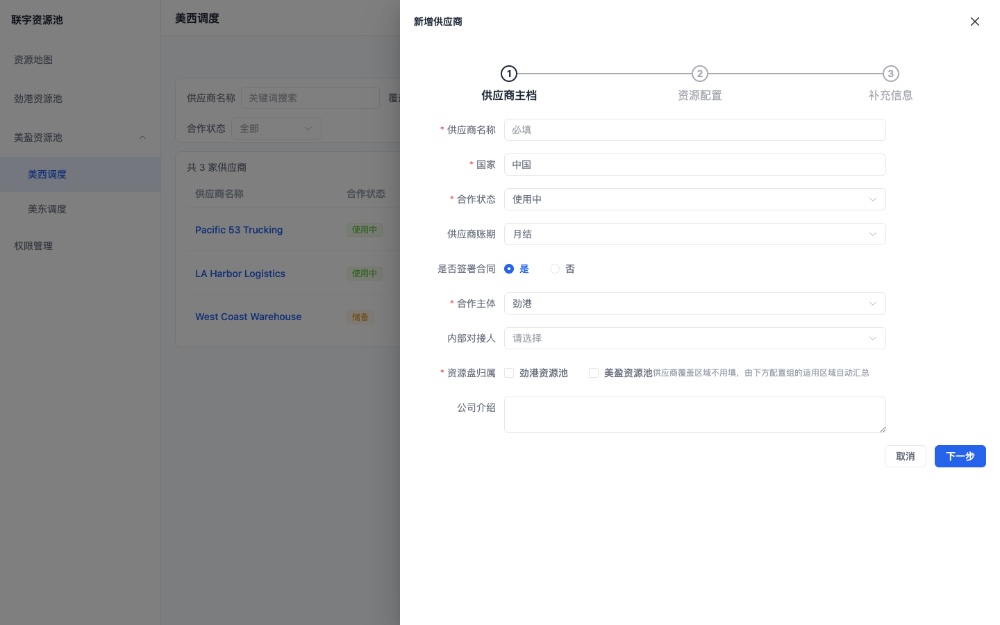
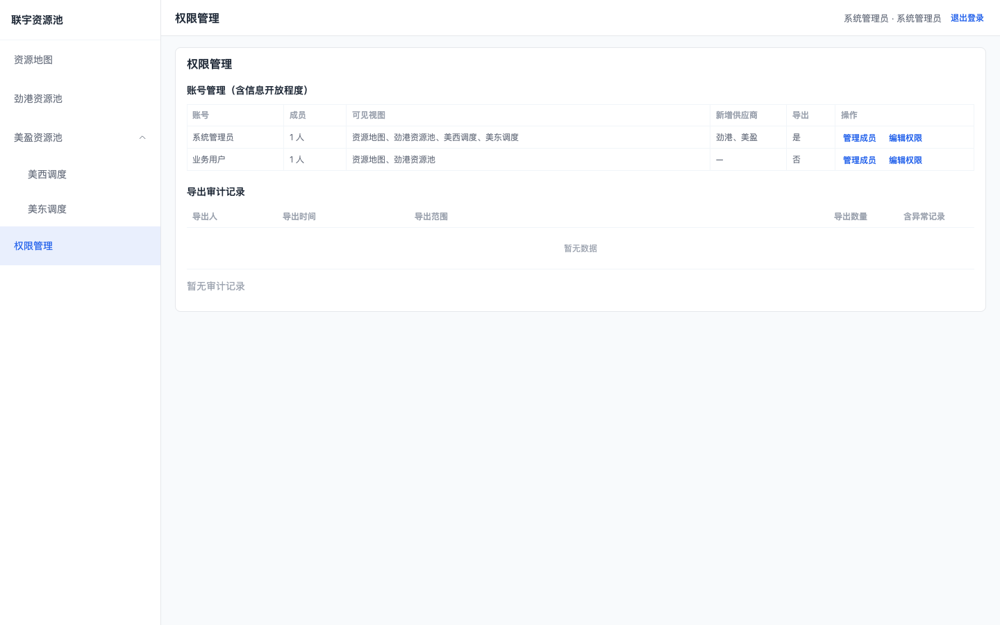

# 联宇资源池 · 使用介绍

> 面向内部团队的供应商资源管理平台：统一管理劲港资源池（国内后段）与美盈资源池（美国本土）的供应商资源。

## 一、访问与登录

- **访问地址**：https://hanhai1999.github.io/supplier-resource-system/
- **登录方式**：使用管理员分配的账号登录（用户名 + 密码）

| 账号 | 用户名 | 密码 | 权限 |
|---|---|---|---|
| 系统管理员 | `admin` | `admin123` | 全部功能 + 账号与权限管理 |
| 业务用户 | `user01` | `user123` | 资源地图、劲港资源池（只读） |

> 更多成员账号由管理员在「权限管理 → 账号管理」中创建，同一账号可多人共用。

## 二、核心功能

### 1. 资源地图（登录后默认进入）

美国资源分布全景图：**节点位置 = 供应商配置的适用区域**，同一城市多家供应商自动聚合为一个节点，**节点越大 = 该城市供应商越多**。

- 鼠标悬停：查看城市、供应商数量、主要业务
- 点击节点：右侧列出该城市全部供应商，再点进详情
- 右下角 `+ / −` 可缩放
- 底部附「地图划分规则」：参考 UPS / FedEx 以 ZIP3 前三位分区，美西 / 美东 / 美湾 / 美中四大区域

### 2. 劲港资源池（国内 / 后段资源）

国内后段供应商统一入口。支持按 **供应商名称、覆盖区域、业务类型（整柜/散货）、服务场景（FBA/FBX）、合作状态** 筛选，条件实时联动结果。

### 3. 供应商详情

点击任意供应商名称进入完整档案：

- 基础信息、内部管理、资源盘归属、覆盖区域
- 资源配置组：每个区域能做哪些业务 / 服务能力（父级继承、节点例外）
- 资源实力（自有车队 / 自有仓库）、联系人、备注
- 异常 / 对接记录：时间线展示，可新增记录并粘贴截图

### 4. 美盈资源池（美国本土资源）

按美西 / 美东调度视图区分，支持按 **服务能力树** 筛选（提柜、53尺派送 Solo/Team、26尺、Broker、LTL、倒货、拆柜合作等）。

### 5. 新增供应商（三步式）

`新增供应商` → ① 主档（名称/国家/账期/资源盘归属等）→ ② 资源配置（按资源盘填写区域业务/能力配置组）→ ③ 补充信息（车队/仓库/联系人/备注）。供应商覆盖区域由配置组自动汇总，无需重复填写。

### 6. 权限管理（仅管理员）

- **账号管理**：账号权限、成员管理（多人共用账号、查看/重置密码）、信息开放程度（每个账号在劲港 / 美盈两块资源池的字段可见与可编辑权限）
- **导出审计**：所有导出操作留痕

## 三、导出

有导出权限的账号可导出资源为 Excel（XLSX），支持按范围导出（全部 / 劲港 / 美盈 / 当前视图 / 当前筛选结果），可选包含异常记录，每次导出自动记录审计。

## 四、常见问题

- **看不到某个供应商？** 检查当前账号的可见视图与字段开放程度（管理员在权限管理中调整）
- **忘记密码？** 联系管理员在「权限管理 → 账号管理」中重置
- **供应商只出现在美盈不出现劲港？** 两个资源池独立配置，需分别在对应配置组中填写
